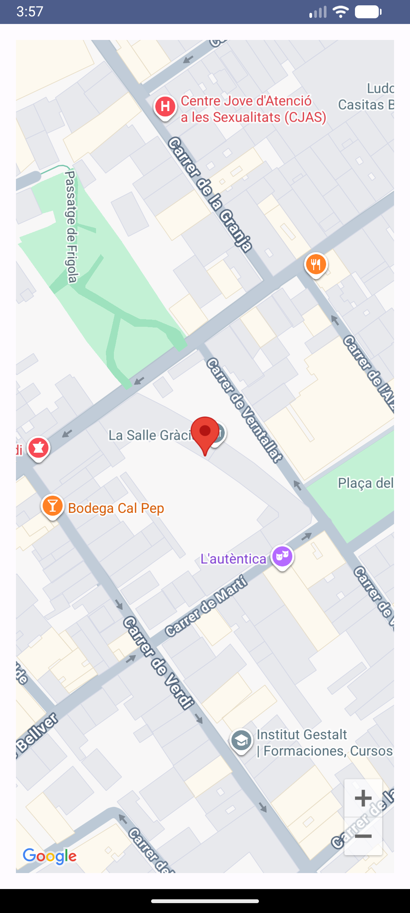
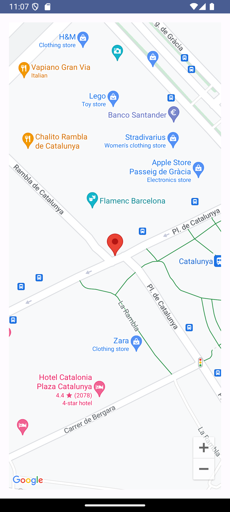

# Google Maps App demo
Aquesta app conté una demo d'ús de la Google Maps API.
És necessari configurar la API Key de Google Maps des del perfil de Google per a què funcioni.

Aquesta app fa servir una API Key que només està guardada en local a l'arxiu secrets.properties dins de la variable **MAPS_API_KEY**.
Serà necessari que us creeu un arxiu de text anomenat **secrets.properties** amb la vostra API Key de Google Maps i el guardeu a l'arrel del repositori.

# Captures

